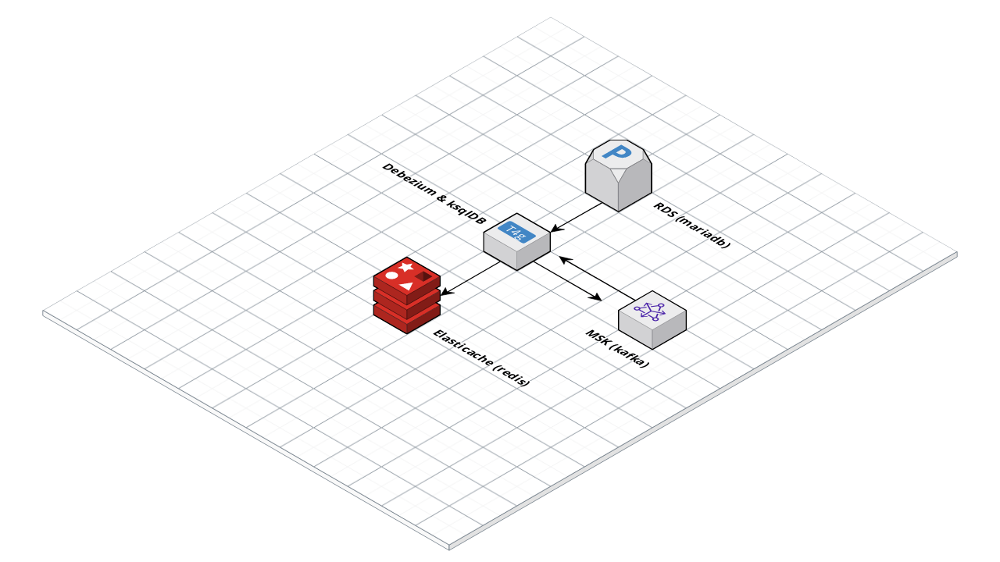

# Change Data Capture (CDC) from MariaDB on RDS to Redis on Elasticache, using Debezium and ksqlDB.

This project creates an environment on AWS using Terraform and Ansible to show a Change Data Capture (CDC) process working end to end from MariaDB on RDS to Redis on Elasticache, using Debezium and ksqlDB.

MariaDB will contain a [users table](./roles/debezium/files/create_users_table.sql) with some sample data, Debezium will [snapshot](./roles/debezium/templates/mariadb_source_connector.json.j2) that data and send any changes to a ([RedPanda](./roles/debezium/tasks/redpanda.yml)) Kafka cluster. Ksqldb will read from Kafka, [count the users](./roles/debezium/templates/queries.ksql.j2) and [sink](./roles/debezium/templates/redis_sink_connector.json.j2) the resulting count to Redis.

This showcases a CDC process from MariaDB to Redis that can be built upon for real world use cases such as caching data.



To use this repo you will need:

* Terraform - Tested using v1.5.7
* Ansible - Tested using 2.14.2

Terraform is used to create the neccessary resources on AWS including an RDS instance, an Elasticache instance and related resources such as subnets and security groups within a VPC. Terraform uses the Ansible Provider to start an Ansible playbook that is used to install and configure Debezium and ksqlDB to process the data.

Once you have cloned the repository, perform the following Ansible command to install cloud.terraform to enable the Ansible provider for Terraform.

```
ansible-galaxy collection install cloud.terraform
```

Once installed, you can use the following to Initialize and deploy the resources using Terraform.

```
terraform init

terraform apply
```

# MSK, RedPanda or WarpStream Options

[RedPanda](https://redpanda.com/) is used by default to create a local kafka compatible cluster to keep costs low.

If you would prefer to use AWS MSK you can rename msk.tf.backup to msk.tf and allow Terraform to create the MSK cluster.

Alternatively you can use [WarpStream](https://www.warpstream.com) for an s3 backed kafka compatible cluster.

If you are using WarpStream, populate the WarpStream vars in playbook.yml to include your API key, cluster ID and an s3 bucket

# Cost estimate (including AWS MSK)

```
Project: gordonmurray/terraform_rds_debezium_kafka_ksqldb

 Name                                                                     Monthly Qty  Unit                    Monthly Cost

 aws_cloudwatch_log_group.kafka_broker_logs
 ├─ Data ingested                                                   Monthly cost depends on usage: $0.57 per GB
 ├─ Archival Storage                                                Monthly cost depends on usage: $0.03 per GB
 └─ Insights queries data scanned                                   Monthly cost depends on usage: $0.0057 per GB

 aws_db_instance.default
 ├─ Database instance (on-demand, Single-AZ, db.t4g.micro)                        730  hours                         $12.41
 ├─ Storage (general purpose SSD, gp2)                                             20  GB                             $2.54
 └─ Additional backup storage                                       Monthly cost depends on usage: $0.095 per GB

 aws_elasticache_replication_group.default
 └─ ElastiCache (on-demand, cache.t4g.micro)                                      730  hours                         $12.41

 aws_instance.debezium_ksqldb
 ├─ Instance usage (Linux/UNIX, on-demand, t4g.small)                             730  hours                         $13.43
 └─ root_block_device
    └─ Storage (general purpose SSD, gp2)                                          20  GB                             $2.20

 aws_kms_key.cloudwatch_key
 ├─ Customer master key                                                             1  months                         $1.00
 ├─ Requests                                                        Monthly cost depends on usage: $0.03 per 10k requests
 ├─ ECC GenerateDataKeyPair requests                                Monthly cost depends on usage: $0.10 per 10k requests
 └─ RSA GenerateDataKeyPair requests                                Monthly cost depends on usage: $0.10 per 10k requests

 aws_kms_key.kafka_key
 ├─ Customer master key                                                             1  months                         $1.00
 ├─ Requests                                                        Monthly cost depends on usage: $0.03 per 10k requests
 ├─ ECC GenerateDataKeyPair requests                                Monthly cost depends on usage: $0.10 per 10k requests
 └─ RSA GenerateDataKeyPair requests                                Monthly cost depends on usage: $0.10 per 10k requests

 aws_kms_key.secrets_manager
 ├─ Customer master key                                                             1  months                         $1.00
 ├─ Requests                                                        Monthly cost depends on usage: $0.03 per 10k requests
 ├─ ECC GenerateDataKeyPair requests                                Monthly cost depends on usage: $0.10 per 10k requests
 └─ RSA GenerateDataKeyPair requests                                Monthly cost depends on usage: $0.10 per 10k requests

 aws_msk_cluster.kafka
 ├─ Instance (kafka.t3.small)                                                   2,190  hours                        $109.28
 └─ Storage                                                                       150  GB                            $16.50

 aws_s3_bucket.warpstream_bucket
 └─ Standard
    ├─ Storage                                                      Monthly cost depends on usage: $0.023 per GB
    ├─ PUT, COPY, POST, LIST requests                               Monthly cost depends on usage: $0.005 per 1k requests
    ├─ GET, SELECT, and all other requests                          Monthly cost depends on usage: $0.0004 per 1k requests
    ├─ Select data scanned                                          Monthly cost depends on usage: $0.002 per GB
    └─ Select data returned                                         Monthly cost depends on usage: $0.0007 per GB

 aws_s3_bucket_lifecycle_configuration.warpstream_bucket_lifecycle
 └─ Standard
    ├─ Storage                                                      Monthly cost depends on usage: $0.023 per GB
    ├─ PUT, COPY, POST, LIST requests                               Monthly cost depends on usage: $0.005 per 1k requests
    ├─ GET, SELECT, and all other requests                          Monthly cost depends on usage: $0.0004 per 1k requests
    ├─ Select data scanned                                          Monthly cost depends on usage: $0.002 per GB
    └─ Select data returned                                         Monthly cost depends on usage: $0.0007 per GB

 aws_secretsmanager_secret.example
 ├─ Secret                                                                          1  months                         $0.40
 └─ API requests                                                    Monthly cost depends on usage: $0.05 per 10k requests

 OVERALL TOTAL                                                                                                      $172.17
──────────────────────────────────
45 cloud resources were detected:
∙ 11 were estimated, 7 of which include usage-based costs, see https://infracost.io/usage-file
∙ 34 were free:
  ∙ 11 x aws_security_group_rule
  ∙ 4 x aws_security_group
  ∙ 3 x aws_route_table_association
  ∙ 3 x aws_subnet
  ∙ 1 x aws_db_option_group
  ∙ 1 x aws_db_parameter_group
  ∙ 1 x aws_db_subnet_group
  ∙ 1 x aws_elasticache_parameter_group
  ∙ 1 x aws_elasticache_subnet_group
  ∙ 1 x aws_internet_gateway
  ∙ 1 x aws_key_pair
  ∙ 1 x aws_msk_configuration
  ∙ 1 x aws_route
  ∙ 1 x aws_route_table
  ∙ 1 x aws_s3_bucket_metric
  ∙ 1 x aws_secretsmanager_secret_version
  ∙ 1 x aws_vpc

┏━━━━━━━━━━━━━━━━━━━━━━━━━━━━━━━━━━━━━━━━━━━━━━━━━━━━┳━━━━━━━━━━━━━━┓
┃ Project                                            ┃ Monthly cost ┃
┣━━━━━━━━━━━━━━━━━━━━━━━━━━━━━━━━━━━━━━━━━━━━━━━━━━━━╋━━━━━━━━━━━━━━┫
┃ gordonmurray/terraform_rds_debezium_kafka_ksqldb   ┃ $172         ┃
┗━━━━━━━━━━━━━━━━━━━━━━━━━━━━━━━━━━━━━━━━━━━━━━━━━━━━┻━━━━━━━━━━━━━━┛
```

### Debugging

To see any output from Ansible, run the following before performing a Terraform apply. This will create a log file that will store the typical Ansible output.

```
export ANSIBLE_LOG_PATH=./ansible.log
```

To connect to ksqldb locally use:

```
sudo /usr/bin/ksql http://0.0.0.0:8088
```